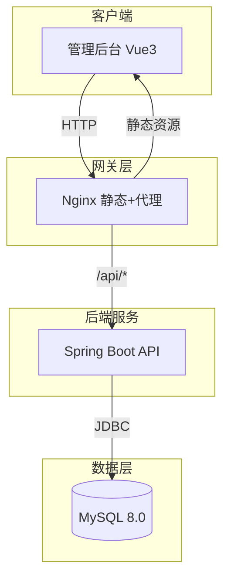
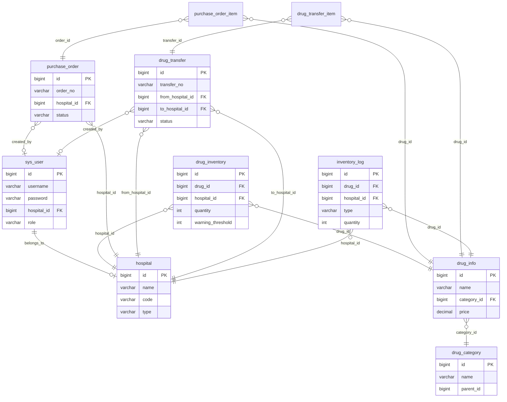

# 医共体药品管理系统 - 项目设计文档

## 1. 系统架构

## 2. ER 图

## 3. 接口清单

### AuthController `/api/auth`
| 方法 | 路径 | 说明 |
|------|------|------|
| POST | /login | 登录 |
| GET | /info | 当前用户信息 |
| POST | /logout | 登出 |

### HospitalController `/api/hospitals`
| 方法 | 路径 | 说明 |
|------|------|------|
| GET | / | 分页列表 |
| GET | /list | 全部列表 |
| GET | /{id} | 详情 |
| POST | / | 新增 |
| PUT | /{id} | 更新 |
| DELETE | /{id} | 删除 |

### DrugCategoryController `/api/drug-categories`
| 方法 | 路径 | 说明 |
|------|------|------|
| GET | /tree | 树形结构 |
| POST | / | 新增 |
| PUT | /{id} | 更新 |
| DELETE | /{id} | 删除 |

### DrugInfoController `/api/drugs`
| 方法 | 路径 | 说明 |
|------|------|------|
| GET | / | 分页列表 |
| GET | /list | 全部列表 |
| GET | /{id} | 详情 |
| POST | / | 新增 |
| PUT | /{id} | 更新 |
| DELETE | /{id} | 删除 |

### InventoryController `/api/inventory`
| 方法 | 路径 | 说明 |
|------|------|------|
| GET | / | 分页列表 |
| GET | /warnings | 预警列表 |
| GET | /quantity | 按药品+机构查库存 |
| GET | /available | 按药品+机构查可用库存 |
| POST | /adjust | 库存调整 |

### InventoryLogController `/api/inventory-logs`
| 方法 | 路径 | 说明 |
|------|------|------|
| GET | / | 分页列表 |

### PurchaseOrderController `/api/purchase-orders`
| 方法 | 路径 | 说明 |
|------|------|------|
| GET | / | 分页列表 |
| GET | /{id} | 详情 |
| POST | / | 新增 |
| PUT | /{id}/approve | 审批 |
| PUT | /{id}/receive | 收货 |
| DELETE | /{id} | 删除 |

### DrugTransferController `/api/transfers`
| 方法 | 路径 | 说明 |
|------|------|------|
| GET | / | 分页列表 |
| GET | /{id} | 详情 |
| POST | / | 新增 |
| PUT | /{id}/approve | 审批 |
| PUT | /{id}/reject | 驳回 |
| PUT | /{id}/ship | 发货 |
| PUT | /{id}/complete | 完成 |

### DashboardController `/api/dashboard`
| 方法 | 路径 | 说明 |
|------|------|------|
| GET | /stats | 统计概览 |

## 4. UI/UX 规范

| 项目 | 规范 |
|------|------|
| 主色调 | #FF7A45（橙） |
| 主色浅 | #FF9A6C |
| 主色深 | #CC5C30 |
| 成功色 | #52C41A |
| 错误色 | #F5222D |
| 主文字 | #333333 |
| 次要文字 | #8C8C8C |
| 卡片圆角 | 8px |
| 卡片阴影 | 0 1px 4px rgba(0,0,0,0.06) |
| 页面背景 | #F5F7FA |
| 卡片背景 | #FFFFFF |
| 字体 | PingFang SC, Microsoft YaHei, sans-serif |
